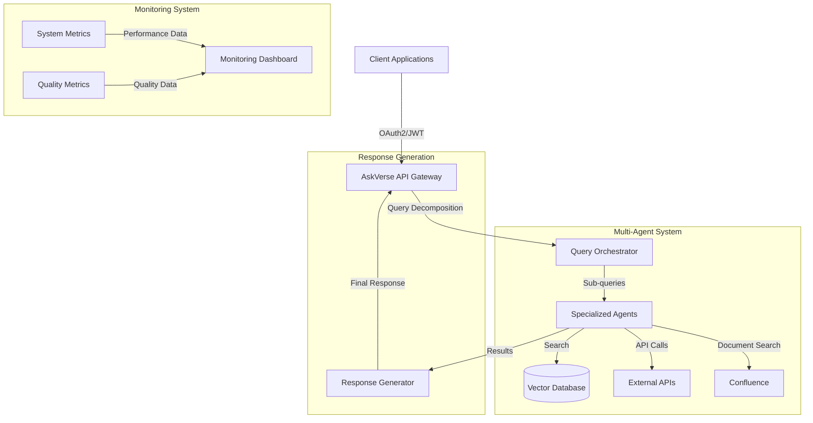
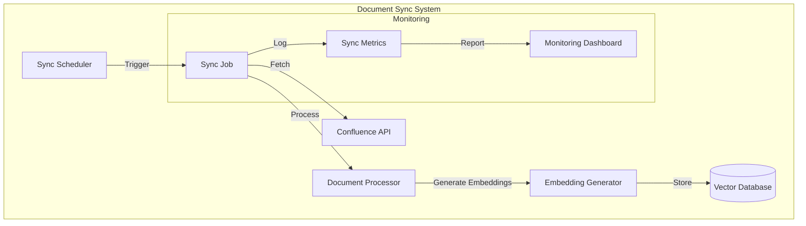
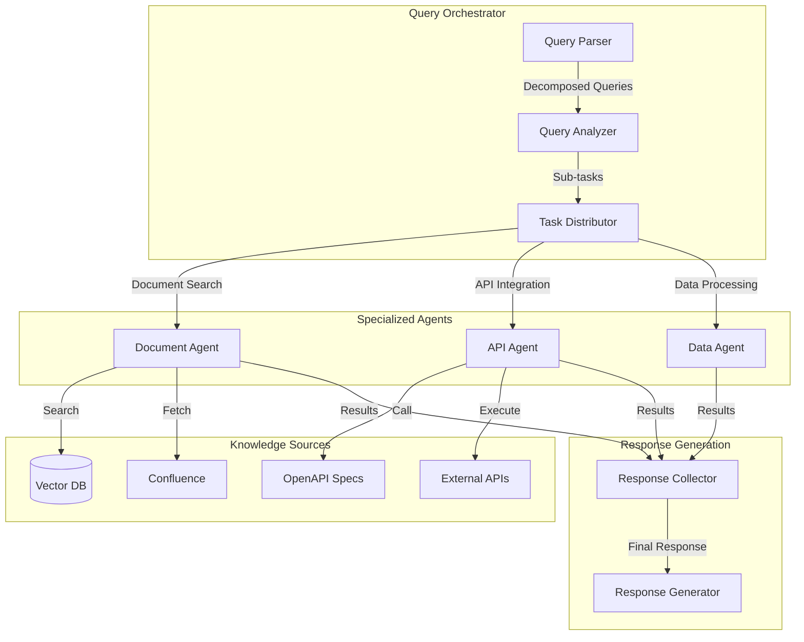
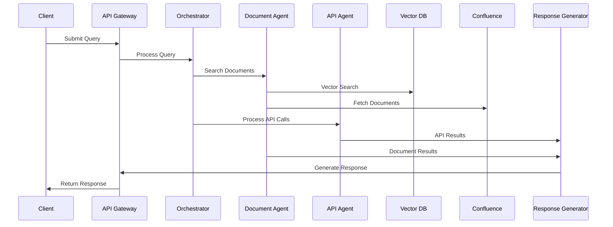

# AskVerse Architecture

## High-Level Architecture

## Document Synchronization Architecture

## Low-Level Architecture

### Multi-Agent System

### Data Flow

## Component Details

### 1. API Gateway
- FastAPI-based REST API
- OAuth2/JWT authentication
- Rate limiting and request validation
- Request/Response logging

### 2. Query Orchestrator
- Query decomposition using LLM
- Task distribution to specialized agents
- Result aggregation and confidence scoring
- Error handling and retry logic

### 3. Specialized Agents
- Document Agent: Handles document search and retrieval
- API Agent: Manages external API interactions
- Data Agent: Processes and transforms data
- Each agent has its own LLM instance for specialized tasks

### 4. Knowledge Sources
- Vector Database: Stores document embeddings
- Confluence Integration: Fetches and syncs documents
- OpenAPI Specs: API documentation and integration
- External APIs: Weather, maps, and other services

### 5. Response Generation
- Result aggregation from multiple sources
- Confidence scoring
- PII detection and masking
- Response formatting and validation

### 6. Monitoring System
- Performance metrics collection
- Quality assessment
- System health monitoring
- Usage analytics

### 7. Document Synchronization
- Scheduled batch job for document sync
- Confluence API integration for document fetching
- Document processing and chunking
- Embedding generation using OpenAI
- Vector database storage and indexing
- Sync monitoring and error handling

## System Requirements

### Hardware Requirements
- Minimum 4GB RAM
- 2 CPU cores
- 20GB storage

### Software Requirements
- Python 3.8+
- PostgreSQL 13+
- Redis 6+ (optional, for caching)

### External Dependencies
- OpenAI API
- Confluence API
- Pinecone Vector DB
- External APIs (Weather, Maps)

## Security Considerations

### Authentication & Authorization
- JWT-based authentication
- Role-based access control
- API key management
- Rate limiting

### Data Security
- PII detection and masking
- Data encryption at rest
- Secure API communication
- Regular security audits

## Performance Optimization

### Caching Strategy
- Response caching
- Document caching
- API result caching
- Cache invalidation

### Scalability
- Horizontal scaling
- Load balancing
- Database optimization
- Resource monitoring

## Deployment

### Containerization
- Docker support
- Docker Compose configuration
- Container orchestration ready

### CI/CD
- Automated testing
- Continuous integration
- Automated deployment
- Version control

### Batch Jobs
- Document sync scheduler
- Error handling and retry logic
- Monitoring and alerting
- Log management 